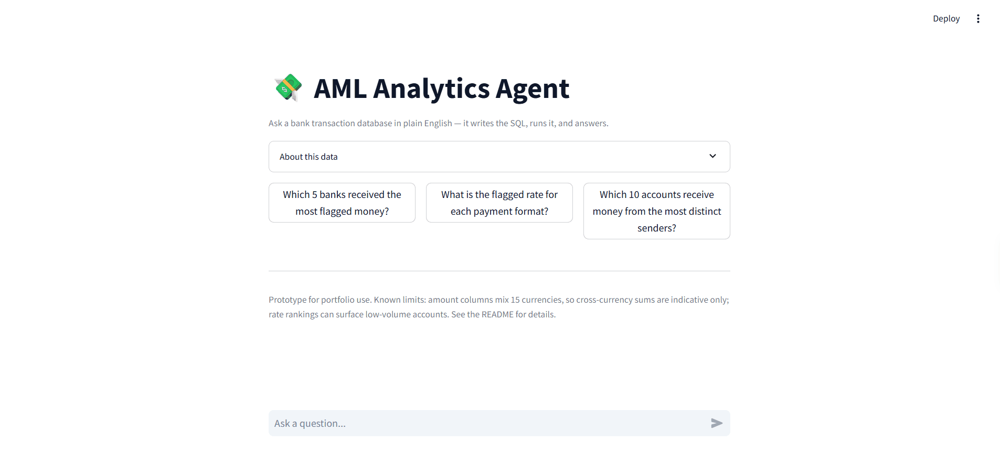

# AML Analytics Agent

A natural-language analytics agent over bank transaction-monitoring data. Ask a
question in plain English; the agent writes SQL, runs it against the database,
self-corrects on errors, and answers — while showing the exact query it ran. It
refuses out-of-scope questions and asks for clarification instead of guessing.

Built with Claude (tool-use), SQLite, and Streamlit.



---

## Why this exists

Analysts spend a lot of time turning questions into SQL. This is a small, honest
prototype of an agent that does that turn safely: it is transparent (shows its
SQL), bounded (read-only, refuses what it can't answer), and measured (a real
evaluation harness, not vibes).

The data is a sampled slice of the public **IBM Transactions for Anti-Money
Laundering (AML)** dataset — a bank transaction-monitoring setting.

## What it does

- **Text → SQL → answer.** Plain-English question in, correct SQL and a concise
  answer out.
- **Agentic retry.** If a query errors, the agent reads the error and rewrites
  the query itself (a tool-use loop), rather than failing.
- **Guardrails.** Read-only (SELECT only); refuses out-of-scope questions and
  asks for clarification on ambiguous ones instead of guessing.
- **Multi-turn.** Clarifications are conversational — answer its question and it
  continues with full context.
- **Transparency.** Every answer shows the SQL it ran.

## Architecture

```
Question ──► Claude (schema + guardrails) ──► run_sql tool ──► SQLite
                    ▲                                            │
                    └──────────── error? retry ◄────────────────┘
                                               │
                                   Answer + the SQL it ran
```

The raw dataset is a single flat transaction file. It is modeled into a small
**star schema** — a `transactions` fact table and an `accounts` dimension — so
the agent reasons over joins rather than one wide table.

- `build_db.ipynb` — samples the raw CSV and builds `aml.db` (the star schema).
- `agent.py` — the agent: schema prompt, `run_sql` tool, retry loop, guardrails.
- `eval.py` — the evaluation harness and benchmark questions.
- `app.py` — the Streamlit chat UI.

## Evaluation

The agent is graded against a 38-question benchmark, run against the real
database:

- **Factual** questions are graded by result — a known-correct reference query is
  run and the agent's output is compared to it.
- **Ranking** questions are graded on the returned categories (e.g. the right
  top-5 banks), ignoring exact totals.
- **Behavioral** questions (vague / out-of-scope) pass only if the agent runs
  **no SQL** — i.e. it correctly clarifies or refuses.

The benchmark spans counts, aggregates, joins, `COUNT(DISTINCT)` fan-in, date
filters, a zero-result edge case, and nine guardrail probes. The agent handles
all case types correctly across runs, with the occasional miss concentrated on
intentionally ambiguous questions it correctly flags rather than answers.

## Known limitations

Found by testing the agent, and deliberately not hidden:

- **Mixed currencies.** The amount columns span 15 currencies (USD, Bitcoin,
  Saudi Riyal, etc.). Summing them without conversion produces inflated,
  meaningless totals; cross-currency sums should be read as indicative only.
- **Small-denominator rates.** Naive "top by percentage" rankings surface
  low-volume accounts where a single flagged transaction swings the rate to
  ~100%. Rate questions need a minimum-volume filter to be meaningful.
- **Synthetic data.** The IBM AML data is simulator-generated; its laundering
  patterns are cleaner than real-world activity.
- **Sampled base rate.** Clean transactions are downsampled for a responsive
  demo, so the flagged share (~2%) is not the true base rate.

## Setup

```bash
git clone <your-repo-url>
cd aml-analytics-agent
pip install -r requirements.txt
```

1. Download `HI-Small_Trans.csv` from the IBM AML dataset (Kaggle) into the
   project folder.
2. Run `build_db.ipynb` to create `aml.db`.
3. Add a `.env` file with your Anthropic key:
   ```
   ANTHROPIC_API_KEY=sk-ant-...
   ```
4. Run the app:
   ```bash
   streamlit run app.py
   ```
   Or run the evaluation:
   ```bash
   python eval.py
   ```

## Notes

- Uses Claude (Haiku) for low-cost text-to-SQL. The model never sees the raw
  rows — SQL does the aggregation and only the question, schema, and a small
  result reach the model, which keeps cost and data exposure low.
- `aml.db`, the raw CSV, and `.env` are intentionally excluded from the repo.
